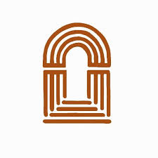

# Kirche Lebensfundament Website

A modern, responsive website for Kirche Lebensfundament in Bruchmühlbach-Miesau, built with React.



## 🎨 Features

- ✅ **Warm terracotta design** – colors taken from the church logo
- ✅ **Fully responsive** – tested on phones (360–430 px), tablets and desktop
- ✅ **Video hero** – worship video with a poster frame while it loads
- ✅ **Events** – regular services and upcoming events in two tabs
- ✅ **Directions** – Google Maps for the church, parking and the train station, with a public transport route
- ✅ **Contact form** – sent by email via FormSubmit, with German validation messages
- ✅ **Legal pages** – Impressum and Datenschutzerklärung (templates with placeholders)

## 🚀 Technologies

- React 18 (Create React App)
- Plain CSS with design tokens (CSS custom properties)
- [AOS](https://michalsnik.github.io/aos/) for scroll animations
- Fonts: EB Garamond (headings) and Inter (body text) via Google Fonts
- Icons: inline SVGs from [Feather](https://feathericons.com) and [Phosphor](https://phosphoricons.com) (Bold)

## 📦 Installation

```bash
# Clone repository
git clone https://github.com/MarceloEito/lebensfundament-website.git
cd lebensfundament-website

# Install dependencies
npm ci

# Start development server
npm start
```

The website opens automatically at [http://localhost:3000](http://localhost:3000).

## 🏗️ Build for Production

```bash
npm run build
```

Creates an optimized production build in the `build` folder.

## 📂 Project Structure

```
lebensfundament-website/
├── public/
│   ├── index.html              # HTML shell, fonts, Content-Security-Policy
│   ├── impressum/index.html    # Impressum (static page)
│   ├── datenschutz/index.html  # Datenschutzerklärung (static page)
│   ├── legal.css               # Shared styles for the legal pages
│   ├── logo.jpeg               # Church logo (also used as favicon)
│   ├── videos/                 # Hero video + poster frame
│   └── *.jpg                   # Church photos and posters (not used yet)
├── src/
│   ├── components/
│   │   ├── Header.js           # Logo, navigation, mobile menu
│   │   ├── Hero.js             # Video hero with info bar
│   │   ├── WhatToExpect.js     # "Über uns" section
│   │   ├── Events.js           # Regular services + upcoming events
│   │   ├── MapSection.js       # "Besuche uns": address, parking, train station
│   │   ├── ContactForm.js      # Contact form (FormSubmit)
│   │   ├── Location.js         # Address banner
│   │   └── Footer.js           # Footer with legal links
│   ├── index.css               # Design tokens and shared styles
│   ├── App.js
│   └── index.js
└── package.json
```

## 🎨 Customization

### Colors and fonts
All colors, fonts, shadows and spacing are defined once as CSS variables at the top of `src/index.css`, e.g.:
- **Terracotta**: `--color-orange: #ab4d13`
- **Text**: `--color-text-primary: #1c1410`
- **Heading font**: `--font-heading` and `--font-heading-weight`

### Content
- **Regular services and upcoming events**: `src/components/Events.js` (upcoming events are placeholders for now)
- **Service times in the footer**: `src/components/Footer.js`
- **Address, parking and station maps**: `src/components/MapSection.js`
- **Contact form recipient**: `FORM_ENDPOINT` in `src/components/ContactForm.js`
- **Hero video**: replace `public/videos/background.mp4` (and `background-poster.jpg`)

### Contact form
Messages are forwarded by [FormSubmit](https://formsubmit.co). After the first submission FormSubmit sends an activation email to the recipient address; messages only arrive once the "Activate Form" link has been confirmed.

### Legal pages
`public/impressum/index.html` and `public/datenschutz/index.html` contain placeholders in `[square brackets]` that must be filled in before going live. They are templates, not legal advice.

## 🌐 Deployment

The site is a static build, so any static host works. Hosts that rebuild automatically on every push are recommended:

- **Netlify** or **Cloudflare Pages**: connect the GitHub repo, build command `npm run build`, output folder `build`
- **Vercel**: `npx vercel`

## 🔒 Branch Protection

This repository uses Branch Protection Rules:
- ❌ No direct pushing to `main`
- ✅ All changes via Pull Requests
- ✅ At least 1 approval required

### Workflow for Changes:

```bash
# Create new feature branch
git checkout -b feature/my-change

# Make changes and commit
git add .
git commit -m "Description of changes"

# Push branch
git push origin feature/my-change

# Create Pull Request on GitHub
```

## 📱 Contact

**Kirche Lebensfundament**
- 📍 Eichenhübel 14, 66892 Bruchmühlbach-Miesau, Germany
- 🕐 Sunday Service: 11:00 AM
- 🙏 Prayer Meeting: Tuesday 6:30 PM
- 🎸 Youth: Friday 7:00 PM
- ⚡ Teens: weekly (time to be announced)

## 📄 License

This project is private and created for Kirche Lebensfundament.

## 🙏 Credits

Developed with ❤️ for Kirche Lebensfundament

---

**"Jesus ist unser Lebensfundament" - "Jesus is our life foundation"**
